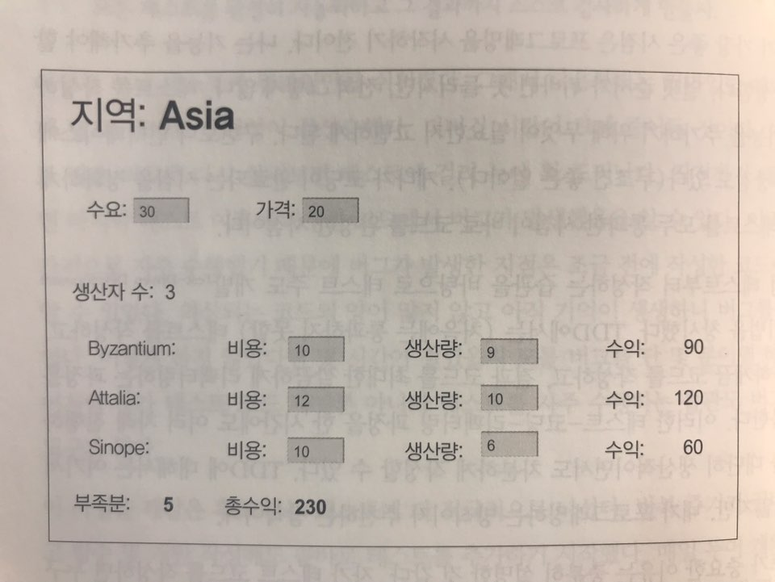
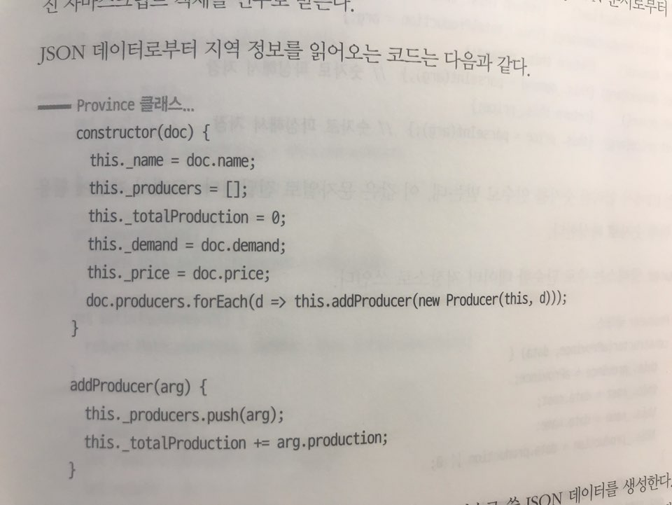

##### Chapter 04 - 테스트 구축하기

- 테스트 코드가 있어야 제대로 리팩터링 할 수 있다.
- 테스트 코드가 있으면 효율이 높아진다.

- 자가 테스트 코드의 가치
    - 테스트를 완전히 자동화하자. 결과 체크까지.
    - 테스트 코드가 있으면 회귀 버그, 즉 새로운 기능 추가로, 기존에 잘 동작하던 기능에서 버그가 발생한 경우를 거의 즉시 찾아낼 수 있다.
    - 테스트 코드로 스펙 정리 & 정의 -> 구현 -> 테스트 -> 리팩토링 = TDD
    - 리팩토링하려면 테스트 코드는 필요하다.

 

- 테스트할 샘플 코드
    - 
        - 엑셀과 비슷한 기능이라 생각하면 된다.
        - 비지니스 로직은 생산자를 표현하는 Producer, 지역 전체를 표현하는 Province 두 개로 구성된다.

        - 
            - Province 클래스는 생성자를 통해 데이터를 받고, 이를 Private 변수에 할당한다.
            - Province 클래스는 게터와 세터로 이루어진 다양한 데이터 접근자들을 가지고 있다.
            - Province 클래스는 생상 부족분, 수익을 계산하는 멤버함수들을 가지고 있다.
        
        - sampleProvinceData 함수는 provinceClass의 인스턴스를 만들 때 생성자로 데이터를 밀어 넣어주는 함수다. 해당 함수의 테스트는 반환 값으로 Province 객체를 생성해보면 된다.

        - 
            - Producer 클래스는 주로 데이터 저장소로 쓰인다. (게터 + 세터 + 내부변수)
